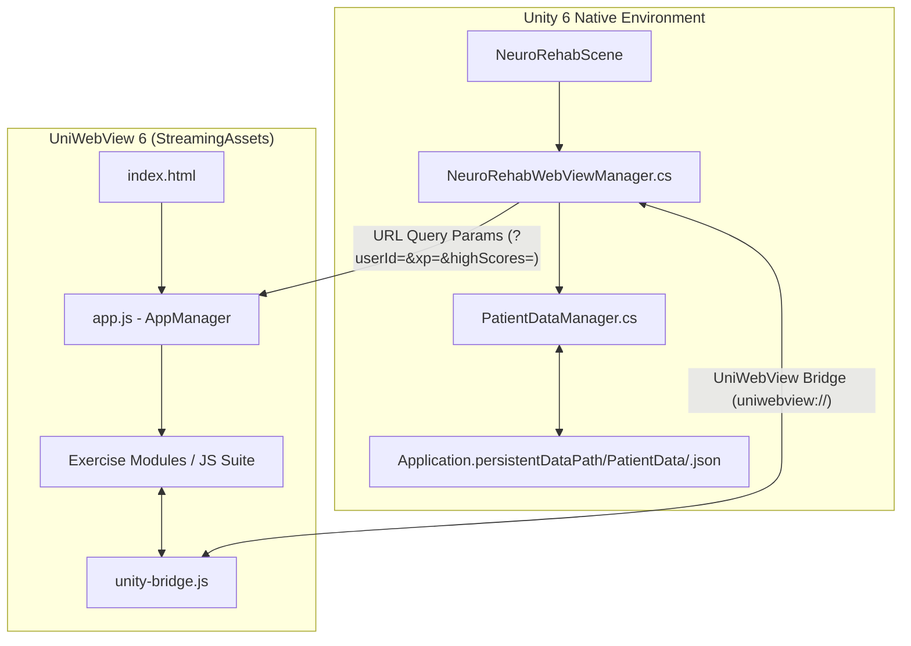

# 🧠 NeuroRehab Cognitive Therapy Portal

[](https://unity.com/)
[](https://developer.android.com/)
[](https://uniwebview.com/)
[]()

> A modern, interactive mobile therapy suite built in **Unity 6** featuring an embedded **HTML5/JavaScript cognitive rehabilitation platform**. Designed for neurological patients to practice motor control, visual search, memory recall, and executive function exercises with real-time patient progress tracking.

---

## 🌟 Key Features

- **🧩 Embedded HTML5/JS Therapy Suite**: Lightweight, responsive web games running locally via **UniWebView 6** inside Unity for ultra-smooth UI performance.
- **📊 Real-Time Patient Analytics**: Dynamically tracks accuracy rates, high scores, activity completion counts (`0/16`), and progress statistics across therapy sessions.
- **⚡ Native C# to JS Bridge**: Two-way communication protocol between Unity (`NeuroRehabWebViewManager.cs`) and JavaScript (`unity-bridge.js`).
- **💾 100% Pure JSON Per-User Storage**: Multi-user disk storage model where each patient's data is isolated into `<userId>.json` files without relying on browser `localStorage`.
- **📱 One-Click Android Build Pipeline**: Custom editor batch script (`BuildScript.cs`) for automated APK generation and deployment.

---

## 🎮 Therapy Exercises & Categories

The portal includes **16+ specialized cognitive exercises** grouped into distinct neurological focus areas:

| Focus Domain | Exercise Module | Clinical Objective |
| :--- | :--- | :--- |
| **✋ Motor Control** | `Trace the Shape` / `Trace Letter` | Fine motor control, path precision, and hand-eye coordination. |
| **👁️ Visual Attention** | `Eagle Eye` | Selective visual search, target discrimination under time limits. |
| **🎨 Spatial Logic** | `Colour Fill Exercise` | Spatial orientation, region segmentation, and visual-spatial reasoning. |
| **🧠 Memory & Recall** | `Memory` / `Object Recall` | Short-term working memory, pattern matching, and item recognition. |
| **⚡ Executive Function** | `Task Switching` / `Quick Switch` | Cognitive flexibility, set-shifting, and rapid mental adaptation. |
| **🎯 Inhibitory Control** | `Color Confusion` (Stroop) | Stroop effect training, impulse control, and response inhibition. |
| **🧮 Processing Speed** | `Quick Count` / `Odd One Out` | Quantitative estimation, speed of processing, and discrepancy detection. |
| **🔄 Motor Adaptation** | `Turnabout` / `Turning Tables` | Rotational tracking, spatial orientation adjustment, and dynamic visual response. |

---

## 🏗️ Architecture & Data Flow



### Protocol & Message Passing
1. **Unity Initialization**: `PatientDataManager` retrieves or creates the user's dedicated JSON file at `Application.persistentDataPath/PatientData/<userId>.json`.
2. **WebView Launch**: `NeuroRehabWebViewManager` opens local `index.html` from `StreamingAssets/NewNeuroGame` passing JSON-encoded patient data (`userId`, `patient`, `xp`, `highScores`, `progressData`, `highAccuracies`) in the query string.
3. **App Startup**: `app.js` initializes `AppManager`, parses URL parameters directly into `gameState` (bypassing browser `localStorage`), and renders the therapy lobby cards.
4. **Session Sync**: Completing an exercise sends progress updates back to Unity via `uniwebview://score_sync?...` payload schemes, updating `PatientProfile` and saving directly back to disk in `<userId>.json`.

---

## 📁 Repository Structure

```
NeuroRehab Cognitive Therapy Portal/
├── Assets/
│   ├── Editor/
│   │   └── BuildScript.cs                # Unity Batchmode Android build script
│   ├── Neuro-Rehab/
│   │   ├── Scenes/
│   │   │   └── NeuroRehabScene.unity     # Main application scene
│   │   └── Scripts/
│   │       ├── NeuroRehabLauncher.cs     # Native UI & Launcher script
│   │       ├── NeuroRehabWebViewManager.cs # UniWebView controller & JS bridge
│   │       ├── PatientDataManager.cs     # Per-user JSON persistence manager
│   │       └── PatientProfile.cs         # Patient profile & JSON data model
│   ├── StreamingAssets/
│   │   └── NewNeuroGame/                 # Embedded HTML5/JS therapy app
│   │       ├── css/                      # Responsive stylesheets
│   │       ├── js/                       # Core AppManager & 16+ game modules
│   │       └── index.html                # Main entry point
│   └── UniWebView/                       # UniWebView SDK component
├── Builds/                               # Output APK build destination
├── ProjectSettings/                      # Unity project configuration
└── README.md
```

---

## 🛠️ How to Integrate & Reuse in a New Unity Project

When adding this therapy portal architecture to a new Unity project, follow these steps:

### Step 1: Copy Core C# Scripts
Copy the 4 core scripts into your project's `Assets/Scripts/` directory:
- `PatientProfile.cs` (Data model for `userId`, `patientName`, `totalXP`, `highScoresJson`, `progressJson`, `highAccuraciesJson`)
- `PatientDataManager.cs` (Per-user JSON file reader/writer at `PatientData/<userId>.json`)
- `NeuroRehabWebViewManager.cs` (UniWebView controller launching `index.html` with URL query parameters and receiving `score_sync`)
- `NeuroRehabLauncher.cs` (UI controller connecting native buttons and profile launches)

### Step 2: Copy HTML Web App
Copy the `NewNeuroGame` directory into your project's `StreamingAssets`:
```text
Assets/StreamingAssets/NewNeuroGame/
  ├── index.html
  ├── css/
  └── js/
      ├── app.js
      └── unity-bridge.js
```

### Step 3: Install UniWebView
Ensure the **UniWebView 6** package is installed in your project.

### Step 4: Launch Session for Any User (Code Example)
Call this snippet from any script when a user clicks **Play** or opens a therapy session:

```csharp
using NeuroRehab;

public void PlayGameForUser(string targetUserId, string targetUserName)
{
    // 1. Get or create the user's profile (automatically loads <targetUserId>.json from disk)
    PatientProfile profile = PatientDataManager.Instance.GetOrCreateProfile(targetUserId, targetUserName);
    
    // 2. Set as active profile
    PatientDataManager.Instance.SetActiveProfile(profile);

    // 3. Launch Web View (automatically passes profile JSON metrics into HTML)
    NeuroRehabWebViewManager.Instance.OpenWebView(profile);
}
```

```csharp
// Example Usage:
PlayGameForUser("user_101", "John Doe");   // Loads & saves to: .../PatientData/user_101.json
PlayGameForUser("user_202", "Jane Smith"); // Loads & saves to: .../PatientData/user_202.json
```

---

## 📱 Building & Deploying to Android

### Automated Command-Line Build
You can trigger a batchmode build directly from the terminal:

```bash
/Applications/Unity/Hub/Editor/6000.3.9f1/Unity.app/Contents/MacOS/Unity \
  -batchmode \
  -quit \
  -projectPath "/path/to/NeuroRehab Cognitive Therapy Portal" \
  -executeMethod BuildScript.BuildAndroidAPK \
  -logFile unity_build.log
```

### Installing on Connected Device
Deploy the compiled APK to a connected Android target using ADB:

```bash
# Install APK
adb install -r Builds/NeuroRehab.apk

# Launch Main Unity Activity
adb shell monkey -p com.Wizio.com -c android.intent.category.LAUNCHER 1
```

---

## 📝 License & Contact

Developed for **NeuroRehab Cognitive Therapy Portal**. All rights reserved.
