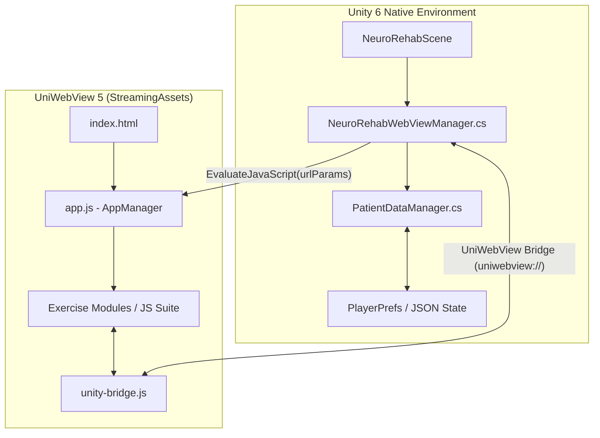

# 🧠 NeuroRehab Cognitive Therapy Portal

[](https://unity.com/)
[](https://developer.android.com/)
[](https://uniwebview.com/)
[]()

> A modern, interactive mobile therapy suite built in **Unity 6** featuring an embedded **HTML5/JavaScript cognitive rehabilitation platform**. Designed for neurological patients to practice motor control, visual search, memory recall, and executive function exercises with real-time patient progress tracking.

---

## 🌟 Key Features

- **🧩 Embedded HTML5/JS Therapy Suite**: Lightweight, responsive web games running locally via **UniWebView 5** inside Unity for ultra-smooth UI performance.
- **📊 Real-Time Patient Analytics**: Dynamically tracks accuracy rates, high scores, activity completion counts (`0/16`), and progress statistics across therapy sessions.
- **⚡ Native C# to JS Bridge**: Two-way communication protocol between Unity (`NeuroRehabWebViewManager.cs`) and JavaScript (`unity-bridge.js`).
- **🛡️ Fault-Tolerant State Persistence**: Robust local storage state management that gracefully handles incomplete patient sessions, offline play, and session resumption.
- **📱 One-Click Android Build Pipeline**: Custom editor batch script (`BuildScript.cs`) for automated APK generation and deployment.

---

## 🎮 Therapy Exercises & Categories

The portal includes **16+ specialized cognitive exercises** grouped into distinct neurological focus areas:

| Focus Domain | Exercise Module | Clinical Objective |
| :--- | :--- | :--- |
| **✋ Motor Control** | `Trace the Shape` / `Trace Letter` | Fine motor control, path precision, and hand-eye coordination. |
| **👁️ Visual Attention** | `Eagle Eye` | Selective visual search, target discrimination under time limits. |
| **🎨 Spatial Logic** | `Colour Fill Exercise` | Spatial orientation, region segmentation, and visual-spatial reasoning. |
| **🧠 Memory & Recall** | `Memory` / `Object Recall` | Short-term working memory, pattern matching, and item recognition. |
| **⚡ Executive Function** | `Task Switching` / `Quick Switch` | Cognitive flexibility, set-shifting, and rapid mental adaptation. |
| **🎯 Inhibitory Control** | `Color Confusion` (Stroop) | Stroop effect training, impulse control, and response inhibition. |
| **🧮 Processing Speed** | `Quick Count` / `Odd One Out` | Quantitative estimation, speed of processing, and discrepancy detection. |
| **🔄 Motor Adaptation** | `Turnabout` / `Turning Tables` | Rotational tracking, spatial orientation adjustment, and dynamic visual response. |

---

## 🏗️ Architecture & Data Flow



### Protocol & Message Passing
1. **Unity Initialization**: `PatientDataManager` retrieves patient info, high scores, and progress statistics.
2. **WebView Load**: `NeuroRehabWebViewManager` opens local `index.html` from `StreamingAssets/NewNeuroGame` passing JSON encoded patient data in the query string.
3. **App Startup**: `app.js` initializes `AppManager`, safely parses query parameters & local storage, and renders the therapy lobby cards.
4. **Session Sync**: Completing an exercise sends progress updates back to Unity via `uniwebview://` payload schemes for persistent logging.

---

## 📁 Repository Structure

```
NeuroRehab Cognitive Therapy Portal/
├── Assets/
│   ├── Editor/
│   │   └── BuildScript.cs                # Unity Batchmode Android build script
│   ├── Neuro-Rehab/
│   │   ├── Scenes/
│   │   │   └── NeuroRehabScene.unity     # Main application scene
│   │   └── Scripts/
│   │       ├── NeuroRehabWebViewManager.cs # UniWebView controller & JS bridge
│   │       └── PatientDataManager.cs     # Patient state & score persistence
│   ├── StreamingAssets/
│   │   └── NewNeuroGame/                 # Embedded HTML5/JS therapy app
│   │       ├── css/                      # Responsive stylesheets
│   │       ├── js/                       # Core AppManager & 16+ game modules
│   │       └── index.html                # Main entry point
│   └── UniWebView/                       # UniWebView 5 SDK component
├── Builds/                               # Output APK build destination
├── ProjectSettings/                      # Unity project configuration
├── README.md
└── .gitignore                            # Standard Unity git ignore rules
```

---

## 🚀 Getting Started

### Prerequisites
- **Unity Editor**: `6000.3.9f1` (or compatible Unity 6 release)
- **Android SDK & NDK**: Installed via Unity Hub Android Build Support
- **ADB (Android Debug Bridge)**: For physical device deployment and logs

### Opening in Unity
1. Clone the repository:
   ```bash
   git clone https://github.com/Akshayykadam/NeuroRehab-Cognitive-Therapy-Portal-Unity.git
   ```
2. Launch **Unity Hub**, click **Add**, and select the project directory.
3. Open the main scene: `Assets/Neuro-Rehab/Scenes/NeuroRehabScene.unity`.

---

## 🛠️ Building & Deploying to Android

### Automated Command-Line Build
You can trigger a batchmode build directly from the terminal:

```bash
/Applications/Unity/Hub/Editor/6000.3.9f1/Unity.app/Contents/MacOS/Unity \
  -batchmode \
  -quit \
  -projectPath "/path/to/NeuroRehab Cognitive Therapy Portal" \
  -executeMethod BuildScript.BuildAndroidAPK \
  -logFile unity_build.log
```

### Installing on Connected Device
Deploy the compiled APK to a connected Android target using ADB:

```bash
# Install APK
adb install -r Builds/NeuroRehab.apk

# Launch Main Unity Player Activity
adb shell am start -n com.Wizio.com/com.unity3d.player.UnityPlayerGameActivity
```

---

## 📝 License & Contact

Developed for **NeuroRehab Cognitive Therapy Portal**. All rights reserved.
